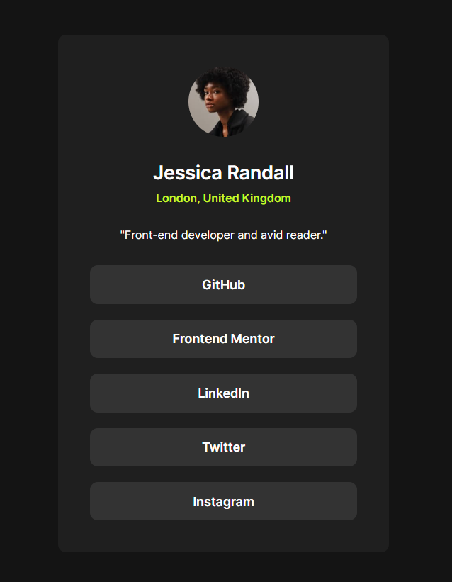

# Frontend Mentor - Social links profile solution

This is a solution to the [Social links profile challenge on Frontend Mentor](https://www.frontendmentor.io/challenges/social-links-profile-UG32l9m6dQ). Frontend Mentor challenges help you improve your coding skills by building realistic projects. 

## Table of contents

- [Overview](#overview)
  - [The challenge](#the-challenge)
  - [Screenshot](#screenshot)
  - [Links](#links)
- [My process](#my-process)
  - [Built with](#built-with)
  - [What I learned](#what-i-learned)
- [Author](#author)

## Overview

### The challenge

Users should be able to:

- See hover and focus states for all interactive elements on the page
- See selection colors

### Screenshot



### Links

- Solution URL: [MrLanter Solution](https://www.frontendmentor.io/solutions/simple-page-using-semantic-responsive-meta-and-flexbox-YRrkEHayjL)
- Live Site URL: [MrLanter Live Site](https://mrlanter.github.io/social-links-frontend-mentor/)

## My process

### Built with

- Semantic HTML
- CSS custom properties
- Flexbox

### What I learned

For Twitter, Discord, ... links :
```html
<meta property="og:title" content="I am a title for Open Graph">
```

Open a link in a new page with `target="_blank` and get security with `rel="noopener noreferrer"` :
```html
<a href="https://www.example.com" target="_blank" rel="noopener noreferrer">
```

I learned how to use CSS custom properties

## Author

- Frontend Mentor - [@MrLanter](https://www.frontendmentor.io/profile/MrLanter)
